# Manual Tests

[Go Back to README.md](https://github.com/HCaldwell95/caldwell-cosmetics-full-stack)

| id  |  Content | Label |
| ------ | ------ | ------ |
| [6](https://github.com/HCaldwell95/caldwell-cosmetics-full-stack/issues/6) | As a user, I can book an appointment so that I can attend and receive my treatment/products. | Must Have |

| [13](https://github.com/HCaldwell95/caldwell-cosmetics-full-stack/issues/13) | As a user, I can edit and/or delete appointments I have booked when logged in so that I can make any necessary changes. | Must Have |

## Epic 1: Core Website Functionality
### Related User Stories

[1](https://github.com/HCaldwell95/caldwell-cosmetics-full-stack/issues/1) - As a user, I can navigate through the website easily so that I can get more information about the treatments, products used and bookings.
 

[2](https://github.com/HCaldwell95/caldwell-cosmetics-full-stack/issues/2) - As a user, I can get information regarding the treatment details so that I can spend less time having to search for the suitable information.
 

[3](https://github.com/HCaldwell95/caldwell-cosmetics-full-stack/issues/3) - As a user, I can obtain treatment booking information so that I can easily book treatments.
 

[12](https://github.com/HCaldwell95/caldwell-cosmetics-full-stack/issues/12) - As a user, I can easily use the navbar to navigate the website so that I can find all relevant content.
 

[15](https://github.com/HCaldwell95/caldwell-cosmetics-full-stack/issues/15) - As a user, I can easily reach the home page in case I get an error so that I am not stuck on an error page and have to select the back button.

These 5 User Stories’ criteria are met on the [Home Page](https://github.com/HCaldwell95/caldwell-cosmetics-full-stack#landing-page). The home page consists of various sections to ensure that the user is informed at all times:

* [Navbar Accessibility](https://github.com/HCaldwell95/caldwell-cosmetics-full-stack#navigation-bar "Navigation Bar") which meets the criteria of [1](https://github.com/HCaldwell95/caldwell-cosmetics-full-stack/issues/1), [12](https://github.com/HCaldwell95/caldwell-cosmetics-full-stack/issues/12) & [15](https://github.com/HCaldwell95/caldwell-cosmetics-full-stack/issues/1) , as it can be easily reached on the home page (and any other page, including error pages) by scrolling to the top of the page or clicking the "Back to Top" button at the bottom of the page, located in the footer.
* [Treatments Section](https://github.com/HCaldwell95/caldwell-cosmetics-full-stack#landing-page "Treatments Section") which meets the criteria of [2](https://github.com/HCaldwell95/caldwell-cosmetics-full-stack/issues/2), as it can be easily reached on the home page directly by utilising the navigation bar or scrolling down to the treatments section and clicking on the link.
* [How to Book Treatments Section](https://github.com/Grawnya/f1-dublin-race-ticket-booking-system#how-to-book-treatments-section "How to Book Tickets Section") which meets the criteria of [3](https://github.com/HCaldwell95/caldwell-cosmetics-full-stack/issues/3), as it can be easily reached on the home page directly by scrolling down the page.

> 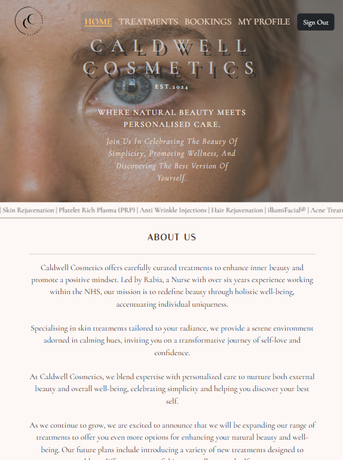
> 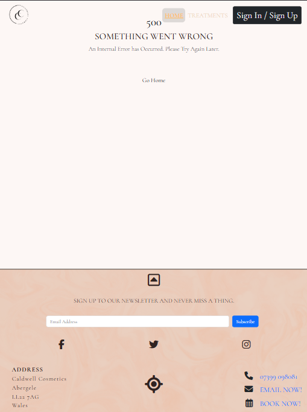
> 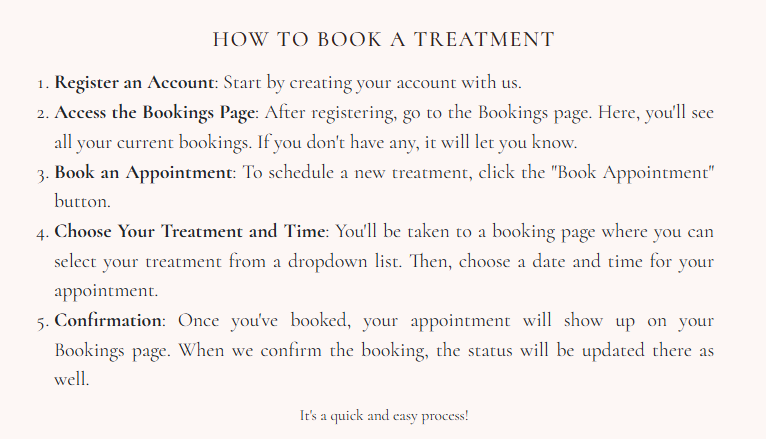
\
&nbsp;

Manual testing here also included: 
* Verifying that the items in this section stacked on top of each other for smaller screens so the information was still easy to obtain. 
* Ensuring that the Google Maps embed feature would appear and remain clear, regardless of what screen the user is viewing the page on.
* Making sure that all links and buttons were working as they were programmed to.

[4](https://github.com/HCaldwell95/caldwell-cosmetics-full-stack/issues/4) - As a user, I can find the business' social media accounts so that I can keep up-to-date with the latest treatments, products and deals offered.

The criteria for [4](https://github.com/HCaldwell95/caldwell-cosmetics-full-stack/issues/4) were fulfilled by adding social media links to the footer. Users can click the corresponding icons to connect with the clinic through their respective platforms.

> 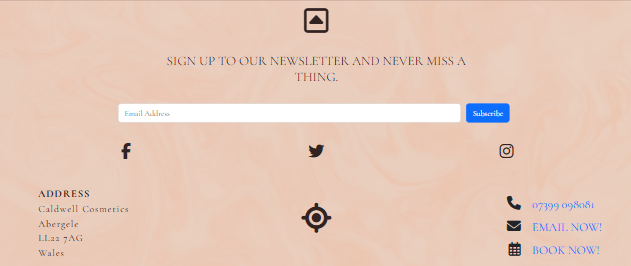
\
&nbsp;

[5](https://github.com/HCaldwell95/caldwell-cosmetics-full-stack/issues/5) - As a user, I can see other people's bookings anonymously so that I can review remaining availability and book in my treatments accordingly.

The criteria of [5](https://github.com/Grawnya/f1-dublin-race-ticket-booking-system/issues/5) was met by creating a system that prevents users from booking appointments at the same date & time if an appointment already exists.

> 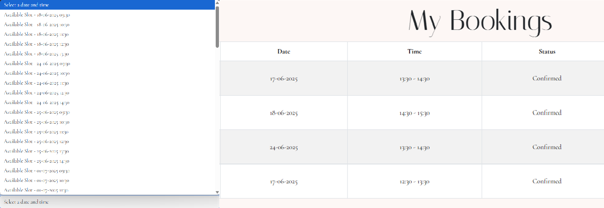 
\
&nbsp;

## Epic 2: User Authentication
### Related User Stories

[7](https://github.com/HCaldwell95/caldwell-cosmetics-full-stack/issues/7) - As a user, I can register or log in so that I can manage my bookings.

The criteria for [7](https://github.com/HCaldwell95/caldwell-cosmetics-full-stack/issues/7) is met by using the `allauth` templates from Django and editing them to match the layout of the rest of the webpage. The user can easily register or login by selecting the `Sign In/Sign Up` link in the navbar. 

If the user has successfully logged in/is authenticated, then an option called `Bookings` can be found on the navbar which allows the users to manage their bookings and book new appointments. All links and buttons have been tested to ensure that they successfully go to the correct webpages.

> 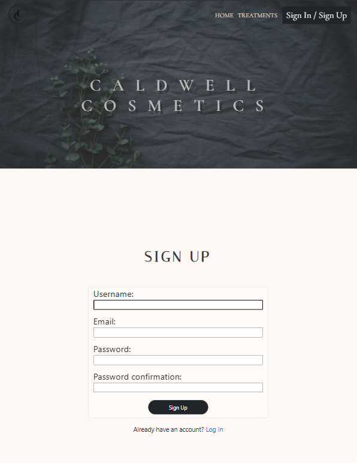

> 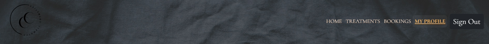
\
&nbsp;

[9](https://github.com/HCaldwell95/caldwell-cosmetics-full-stack/issues/9) - As a user, I can see if I am logged in so that I can easily log out or log in.

Similar to [7](https://github.com/HCaldwell95/caldwell-cosmetics-full-stack/issues/7), the criteria for [9](https://github.com/HCaldwell95/caldwell-cosmetics-full-stack/issues/9) is met when the user has logged in, which is confirmed by the change in Navbar at the top of the screen. The navbar is altered to include a `Signout` button and additional pages such as `Bookings` and `My Profile` The Sign In / Sign Out button is on the top right hand side of the page in large screens and is bigger than the rest of the navbar items to attract the user. The buttons also change to a black background with white text which slightly glows when the user hovers over them to attract them to click on the button.

**When Signed In:**
> 
> 

**When Signed Out:**
> 
\
&nbsp;

[14](https://github.com/HCaldwell95/caldwell-cosmetics-full-stack/issues/14) - As a user, I can edit my user details when logged in so that I can ensure that my details are up-to-date.

To meet the criteria for [14](https://github.com/HCaldwell95/caldwell-cosmetics-full-stack/issues/14), when the user has signed in, a `My Profile` navbar item appears next to the `Sign Out` button. If the user has never created a profile, this item isn't available to them until they sign up. 

When a signed in user clicks on the `My Profile` item, they will be taken to their profile page. On this page, the user can view their details and edit them as they wish. The user is also able to delete their profile on this page.

The form values will be populated with by user. This has been manually tested to ensure that the user has to create a profile before being able to book an appointment.

> 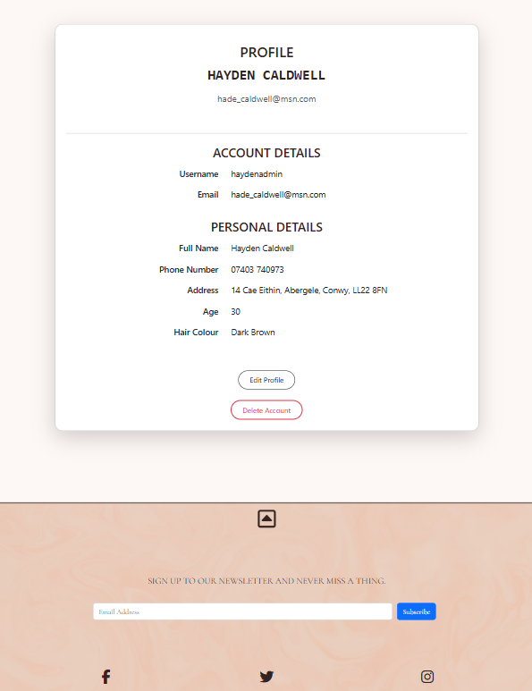
> 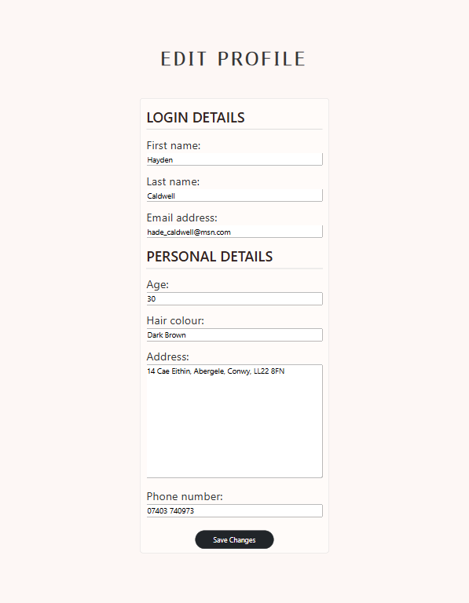
\
&nbsp;
\
&nbsp;

## Epic 3: Admin Functionality
### Related User Stories

[16](https://github.com/HCaldwell95/caldwell-cosmetics-full-stack/issues/16) - As an admin/site owner, I can log in so that I can access the website's backend.

It is equally important to consider the website from the perspective of the admin or site owner. Django makes this straightforward by allowing site owners to register admin users and access model data submitted through forms via the built-in admin interface.

The criteria for [16](https://github.com/HCaldwell95/caldwell-cosmetics-full-stack/issues/16) were met by appending /admin to the homepage URL, which redirects users to the Django admin login page. If the user is not logged in, they are prompted to enter valid credentials.

> 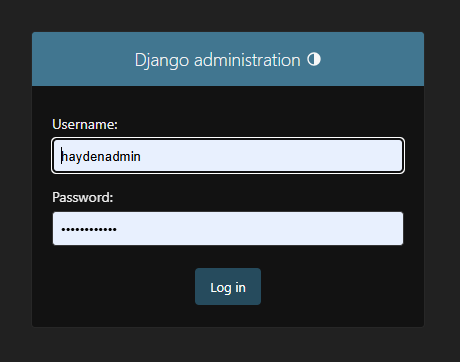

Manual testing confirmed that if a non-admin user attempts to access the `/admin` route, they are logged out and required to log in with valid admin credentials. 

Conversely, if the user is already authenticated and has the appropriate admin privileges, they are automatically redirected to the admin dashboard. From there, they can view and manage all registered models, social media integrations, and recent administrative actions—providing full access to the backend of the site.

> 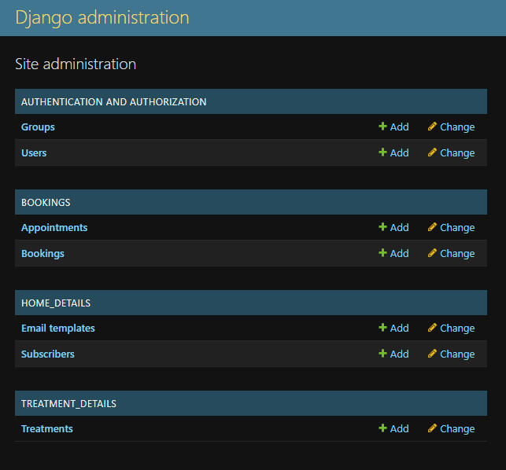
\
&nbsp;

[17](https://github.com/HCaldwell95/caldwell-cosmetics-full-stack/issues/17) - As an admin, I can delete appointments booked by users so that I can alter bookings and amend errors when required.

The criteria for [17](https://github.com/HCaldwell95/caldwell-cosmetics-full-stack/issues/17) were met by accessing the “Bookings” model from the Django admin dashboard. This redirects the admin user to a table displaying all booking entries. If the admin wishes to delete a booking, they can select the desired entry and use the “Action” dropdown menu above the table to choose “Delete selected bookings”, allowing for efficient management of appointment data.

> 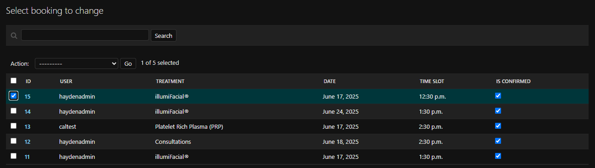

This redirects the admin to a prompt to ask them if they are sure they want to delete the ticket.

> 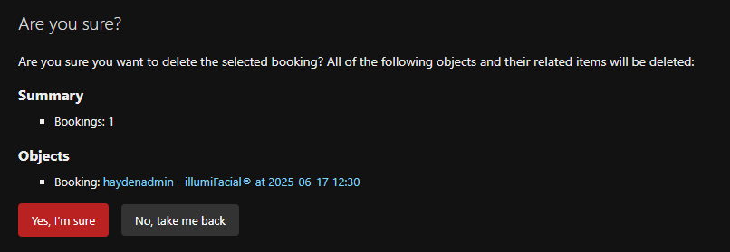

If the admin confirms that they want to delete it, they are redirected to the “Tickets” database, where they receive a message to confirm the deletion and the ticket can no longer be seen.

> 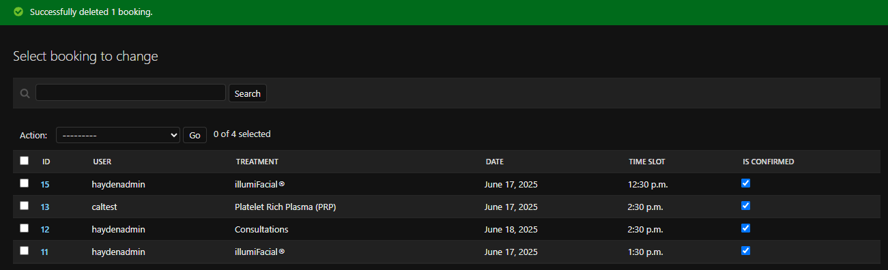

\
&nbsp;

## Epic 4: Ticket Booking Functionality
### Related User Stories

[6](https://github.com/HCaldwell95/caldwell-cosmetics-full-stack/issues/6) - As a user, I can book an appointment so that I can attend and receive my treatment/products.
 

[13](https://github.com/HCaldwell95/caldwell-cosmetics-full-stack/issues/13) - As a user, I can edit and/or delete appointments I have booked when logged in so that I can make any necessary changes.

The primary function of the website is to allow users to book appointments and to manage their bookings by editing or deleting them as needed.

Manual testing confirms that users must be logged in and have created a profile before they can book an appointment. This requirement is clearly communicated throughout the site.

Once logged in with a completed profile, users can navigate to the `Bookings` page via the navbar. On this page, users can book appointments and review appointments that they have booked previously.

This fulfills the criteria for [6](https://github.com/HCaldwell95/caldwell-cosmetics-full-stack/issues/6), as users are presented with a form where they can choose their treatment and preferred date/time. The booking form is fully responsive and accessible on smaller screen devices as well.

> 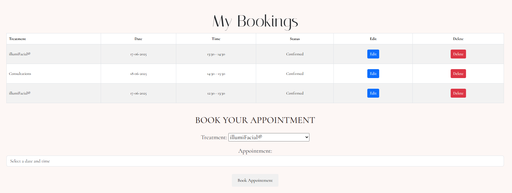

To successfully book an appointment, the following criteria must be met:

1. All required fields in the booking form must be filled out.

2. Users must select an available time slot — they will only be presented with available dates.

3. The user must be logged in and have a completed profile before booking.
\
&nbsp;

**Manually Tested Error Messages**

If any of these criteria are not met, the following error messages will appear:

1. If any required field is left blank, a small error message will appear next to the input, prompting the user to enter a valid value.

Once a treatment and appointment time has been confirmed and the appointment is booked, the user's `Bookings`  page will be refresh and all of their appointments will be visible to them.

> 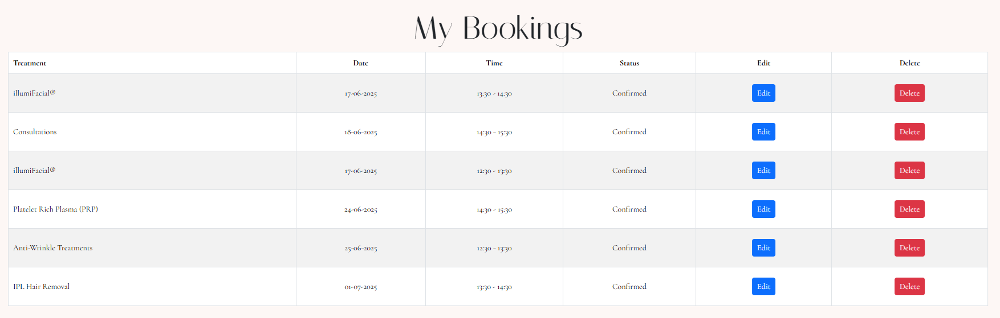

Next to each of the user's bookings, there will be an `Edit` and `Delete` button available to them. This meets the criteria for [13](https://github.com/HCaldwell95/caldwell-cosmetics-full-stack/issues/13) as the user is able to edit their existing bookings by selecting the `Edit` button. Upon clicking, a modal appears allowing the user to alter the desired treatment and/or the appointment date or time by changing the values in the form fields.

Similarly to the `Edit` button, the `Delete` button functions the same, the user clicks it and a modal appears asking the user to confirm that they want to delete their selected appointment. Once confirmed, the database updates and the booking is removed from their `Bookings` page.

> 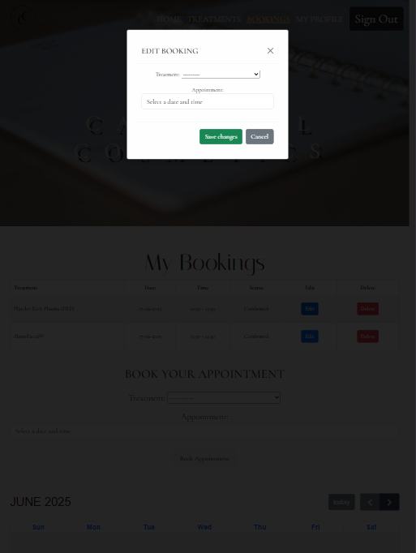
> 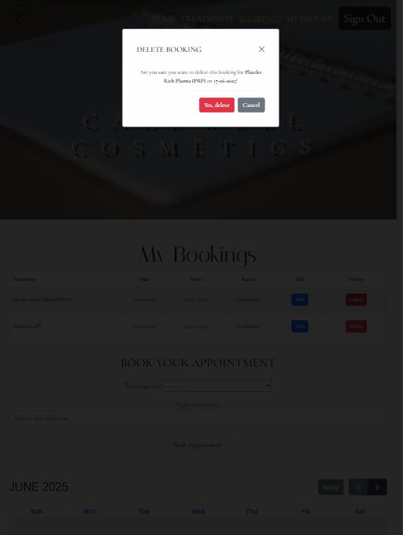
\
&nbsp;

[Go Back to README.md](https://github.com/HCaldwell95/caldwell-cosmetics-full-stack)