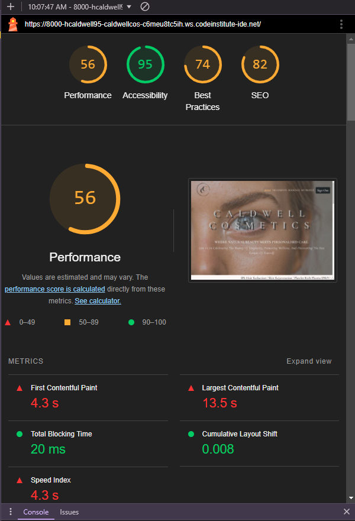

# Caldwell Cosmetics - My Milestone Project


## Introduction

Caldwell Cosmetics is a full-stack web application designed to showcase and manage a cosmetic brand's products and treatments offered. The website includes features like a landing page, designed to inform the user of everything the application has to offer; a treatments page, which provides detailed information on the treatments offered, products used and any aftercare required; an admin interface for content management and a booking system which will allow users to book timeslots on a calendar for their treatments. The project is built using Django and deployed on Heroku.

[Visit the Website Here](website_link)

<a href="https://github.com/HCaldwell95/caldwell-cosmetics-full-stack" target="_blank">
Visit the Project's GitHub Repository Here
</a>

\
&nbsp;

# Table of Contents

1. [Introduction](#introduction "Introduction")
2. [UX - User Experience Design](#ux---user-experience-design "UX - User Experience Design")
   * [Strategy](#strategy "Strategy")
     * [Purpose](#purpose "Purpose")
      * [User Stories](#user-stories "User Stories")
         * [For This Sprint](#for-this-sprint "For This Sprint")
         * [For Future Sprints](#for-future-sprints "For Future Sprints")
   * [Scope](#scope "Scope")
     * [Sprint 1](#sprint-1 "Sprint 1")
     * [Sprint 2](#sprint-2 "Sprint 2")
     * [Future Sprints](#future-sprints "Future Sprints")
   * [Structure](#structure "Structure")
      * [Project Applications](#project-applications "Project Applications")
     * [Project Databases](#project-databases "Project Databases")
		* [Website User](#websiteuser "Website User")
		* [Ticket](#ticket "Ticket")
   * [Surface](#surface "Surface")
    	* [Font](#font "Font")
    	* [Icons](#icons "Icons")
    	* [Colours](#colours "Colours")
    	* [Responsive Screens](#responsive-screens "Responsive Screens")


3. [Features](#features "Features")
   * [Existing Features](#existing-features "Existing Features")
		* [Landing Page](#landing-page "Landing Page")       
		* [Navigation Bar](#navigation-bar "Navigation Bar")       
		* [Scrolling Text Bar](#scrolling-text-bar "Scrolling Text Bar")       
		* [Find Us Map](#find-us-map "Find Us Map")       
		* [How to Book Treatments Section](#how-to-book-treatments-section "How to Book Treatments Section")       
		* [Footer](#footer "Footer")              
		* [Profile](#profile "Profile")   
        * [Treatments Page](#treatments-page "Treatments Page")
        * [Meet The Team Page](#meet-the-team "Meet The Team Page") 
		* [My Bookings Page](#my-bookings-page "My Bookings Page")       
		* [New Booking Page](#new-booking-page "New Booking Page")       
		* [Edit Booking Page](#edit-ticket-page "Edit Booking Page")       
		* [Delete Booking Page](#delete-ticket-page "Delete Booking Page")             
		* [Django Template Pages](#django-template-pages "Django Template Pages")       
		* [Messages](#messages "Messages")       
		* [Error Pages](#error-pages "Error Pages") 
4. [Technologies Used](#technologies-used)
   1. [Programming Language](#programming-language)
   2. [Tools Used To Develop The Application](#tools-used-to-develop-the-application)
   3. [Environment Variables](#environment-variables)
   4. [Database Configuration](#database-configuration)
5. [Testing](#testing)
   1. [Code Validation](#code-validation)
   2. [Manual Testing](#manual-testing)
   3. [Automated Testing](#automated-testing)
   4. [Resolved Bugs](#resolved-bugs)
6. [Deployment](#deployment)
   1. [Preparation](#preparation)
   2. [Deploying the Application to Heroku](#deploying-the-application-to-heroku)
   3. [Forking the Github Repository](#forking-the-github-repository)
   4. [Cloning the Repository on GitHub](#cloning-the-repository-on-github)
7. [Credits](#credits)
   - [Code](#code)
   - [Media](#media)
8. [Disclaimer](#disclaimer)
\
&nbsp;

# UX - User Experience Design
User Experience of UX focuses on how accessible the website is to the user and it’s ease of use, which is crucial to the website’s success.

The UX aspect of the project can be broken down into 5 Planes:
* The Strategy Plane
* The Scope Plane
* The Structure Plane
* The Skeleton Plane
* The Surface Plane
\
&nbsp;

## Strategy
In order to ensure the project aligns with these planes, it is vital to keep the target audience at the forefront at all times. It is vital to ensure that the project has real world use and that its design is transferrable to other sports events which also require the user to book a ticket.

The target audience consists of:
* 18 – 65 year olds.
* People who are conscious of their well-being and enjoy self-care.
* People who like to look their best and treat themselves.
* People who may have minor skin conditions and are looking to alleviate them.

As a result, users will expect:
* A website with easy navigation and a logical progression to its flow.
* Lots of information relating to the treatment details and products used.
* The ability to register and log in to their account to review their treatment history and receive specific recommendations.
* The ability to book, edit and cancel treatments.
\
&nbsp;

### Purpose
The purpose of this website is to promote the Caldwell Cosmetics brand, providing users with the ability to book and amend treatments online. It also serves as a comprehensive resource, offering detailed information on each available treatment.

### User Stories
| id  |  Content | Label |
| ------ | ------ | ------ |
|  [1](https://github.com/HCaldwell95/caldwell-cosmetics-full-stack/issues/1) | As a user, I can navigate through the website easily so that I can get more information about the treatments, products used and bookings. | Must Have |
|  [2](https://github.com/HCaldwell95/caldwell-cosmetics-full-stack/issues/2) | As a user, I can get information regarding the treatment details so that I can spend less time having to search for the suitable information. | Must Have |
|  [3](https://github.com/HCaldwell95/caldwell-cosmetics-full-stack/issues/3) | As a user, I can obtain treatment booking information so that I can easily book treatments. | Must Have |
|  [4](https://github.com/HCaldwell95/caldwell-cosmetics-full-stack/issues/4) | As a user, I can find the business' social media accounts so that I can keep up-to-date with the latest treatments, products and deals offered. | Should Have |
|  [5](https://github.com/HCaldwell95/caldwell-cosmetics-full-stack/issues/5) | As a user, I can see other people's bookings anonymously so that I can review remaining availability and book in my treatments accordingly.| Could Have |
| [6](https://github.com/HCaldwell95/caldwell-cosmetics-full-stack/issues/6) | As a user, I can book an appointment so that I can attend and receive my treatment/products. | Must Have |
| [7](https://github.com/HCaldwell95/caldwell-cosmetics-full-stack/issues/7) | As a user, I can register or log in so that I can manage my bookings. | Must Have |
| [8](https://github.com/HCaldwell95/caldwell-cosmetics-full-stack/issues/8) | As a user, I can book treatments for others so that I can bring more people to the business. | Must Have |
| [9](https://github.com/HCaldwell95/caldwell-cosmetics-full-stack/issues/9) | As a user, I can see if I am logged in so that I can easily log out or log in. | Must Have |
| [10](https://github.com/HCaldwell95/caldwell-cosmetics-full-stack/issues/10) | As a user, I can obtain email confirmation of my ticket bookings so that I know I have successfully booked the treatments. | Could Have |
| [11](https://github.com/HCaldwell95/caldwell-cosmetics-full-stack/issues/11) | As a user, I can select my preferred practitioner when booking treatments and review their remaining availability so I can book my treatments. | Must Have |
| [12](https://github.com/HCaldwell95/caldwell-cosmetics-full-stack/issues/12) | As a user, I can easily use the navbar to navigate the website so that I can find all relevant content. | Must Have |
| [13](https://github.com/HCaldwell95/caldwell-cosmetics-full-stack/issues/13) | As a user, I can edit and/or delete appointments I have booked when logged in so that I can make any necessary changes. | Must Have |
| [14](https://github.com/HCaldwell95/caldwell-cosmetics-full-stack/issues/14) | As a user, I can edit my user details when logged in so that I can ensure that my details are up-to-date. | Must Have |
| [15](https://github.com/HCaldwell95/caldwell-cosmetics-full-stack/issues/15) | As a user, I can easily reach the home page in case I get an error so that I am not stuck on an error page and have to select the back button. | Must Have |
| [16](https://github.com/HCaldwell95/caldwell-cosmetics-full-stack/issues/16) | As an admin, I can log in so that I can access the website's backend. | Must Have |
| [17](https://github.com/HCaldwell95/caldwell-cosmetics-full-stack/issues/17) | As an admin, I can delete appointments booked by users so that I can alter bookings and amend errors when required. | Must Have |

\
&nbsp;

## Scope

To ensure the completion of the current sprint, which includes all elements required for the project submission, the focus was directed as follows:
\
&nbsp;

### Sprint 1
This sprint focuses on the “Must Haves” and the marking criteria:
* Development of a home page with basic information on booking treatments and accessing details about treatments and products.
* Implementation of a navigation bar that allows users to easily access different pages within the site..
* The ability of the user to login and create a profile.
* A booking system that enables users to schedule, edit, or cancel treatments as needed.
\
&nbsp;

### Sprint 2
This sprint builds on Sprint 1:
* Enhancement of the home page with additional details on booking procedures, improved treatment and product information, and added styling and animations for a more engaging user experience.
* Creation of a calendar feature that displays available time slots, allowing users to book treatments at their convenience.
\
&nbsp;

### Future Sprints
Elements to add to the site in the future:
* Integration of email confirmation for bookings.
* Option for users to input payment details to confirm bookings.
* Implementation of a third-party payment processing system to handle transaction payments.
\
&nbsp;

## Structure

Having a well-organized project structure facilitates a logical development process and ensures that sprint tasks can be efficiently tracked. The project is divided into applications to manage different functionalities and database tables to systematically store user data.

### Project Applications

The project consists of four applications:

* home_details: Provides an overview of Caldwell Cosmetics, including sections such as "About Us" and "Find Us." It provides brief descriptions of all treatments and guides users to various parts of the website and social media links.
* treatment_details: Delivers in-depth information about treatments and products, including aftercare instructions and details on who would likely benefit from each treatment.
* meet_the_team_details: Features profiles of the practitioners at Caldwell Cosmetics, highlighting their qualifications and experience to reassure users of their expertise.
* booking_details: Oversees the booking process, including creating, editing, and deleting of bookings. Users are required to create a profile, which is associated with their treatment reservations.

### Project Database

The project features two distinct databases to manage different functionalities:

Subscription Newsletter Database: Manages user subscriptions to the newsletter. This database stores information related to users who subscribe to receive updates and promotions via email.

Booking System Database: Facilitates the calendar-based booking system, allowing users to create, manage, and track their bookings. This database includes user profiles and booking details.

The schematic below illustrates the relationships between the relevant models:

#### Subscription Newsletter

The Subscriber model is used to manage information for users who subscribe to the newsletter. It includes the following field:

* email - The email address of the subscriber, which is used to send newsletters and updates.

#### Booking System

The BookingSystem model captures detailed information about users who book treatments. This model is used to gather comprehensive user data to enhance their booking experience. It includes:

username - A unique username selected by the user during registration.
first_name - The user's first name.
last_name - The user's last name.
email - The user's email address.
address - The user's home address.

The BookingSystem model is linked to the booking records as a foreign key in the booking system. This design allows users to update their personal information without duplicating data entry, thereby enhancing privacy and user experience.

## Skeleton

The initial skeleton provides a broad framework that is refined and expanded upon. It serves as a foundation for developing a plan that aligns with the requirements outlined in the [user stories](#user-stories "User Stories") and the [sprints](#scope "Sprints"). This framework facilitates the creation of wireframes, which act as design tools and outline the basic structure of the website.
\
&nbsp;

### Wirefames
[Balsamiq](https://balsamiq.com/wireframes/ "Balsamiq") was utilised to design the website's layout and navigation flow. I started by developing a mobile version following a mobile-first approach and then created versions for medium and large screens. Ensuring responsiveness across various devices was a key focus.

Basic wireframes are provided below. Please note that these may differ slightly from the final website design:

* [Home Page](image.jpg "Home Page")
* [Treatments](image.jpg "Treatments") – The Treatments Page is very similar to the Home Page as I wanted to maintain consistency throughout the website, with each page acting as a different comprehensive source of information.
* [Meet The Team](image.jpg "Meet The Team") – The Meet The Team Page follows the same rulings and stylings as the Home Page and Treatments Page, showing only detailed information on the practitioners at Caldwell Cosmetics.
* [My Bookings](image.jpg "My Bookings") – The Bookings Page follows the trend, displaying only the information and fields required to create, edit and delete bookings.

## Surface

### Font

The fonts used in this project are imported from Google Fonts:

* <span style="font-family: 'Cormorant', serif;">Cormorant</span>: This font family includes a range of styles, such as italic and varying weights from 300 to 700, providing flexibility for different text elements.

* <span style="font-family: 'Italiana', serif;">Italiana</span>: A single-style serif font that brings a classic, elegant look.
These fonts have been chosen to enhance the visual appeal and readability across the website.

### Icons

Font Awesome has been utilised to obtain some icons for the website. Icons were only utilised in the footer of the page to make the social links stand out as well as small details on the contact details in the footer.

### Colours

The colour palette used in this project has been carefully chosen to create a soft, professional, and visually appealing design. Here’s an explanation of each colour and its role:

* --color-background-light (rgb(255, 251, 249)): A soft off-white background that offers a clean, minimalistic base for the site's layout.

* --color-background-cream (rgb(253, 247, 245)): A warm cream tone that provides a welcoming and gentle contrast, adding depth to the background.

* --color-border (rgba(0, 0, 0, 0.5)): A semi-transparent black used for subtle borders around key elements, providing structure without overpowering the design.

* --color-heading (black): A bold black colour that ensures clarity and emphasis for headings and key text elements.

* --color-accent (#eed6c2): A peachy accent that brings warmth and soft contrast, drawing attention to interactive or highlighted sections of the site.

* --color-accent-dark (#302121): A deep, dark brown used for text and links, creating an elegant contrast that is easy to read.

* --color-overlay (rgba(95, 95, 95, 0.4)): A grey overlay used in hero sections to subtly darken background images, ensuring text and foreground elements are clear.

* These colours, combined with the defined font sizes and border styling, enhance the site's readability, aesthetic appeal, and user experience.

### Responsive Screens

The following breakpoints have been chosen to ensure the design adapts seamlessly across various screen sizes, providing an optimal user experience:

- **768px (Tablets)**: Targets smaller tablets and larger smartphones. The layout adjusts to portrait tablet viewing, ensuring content is readable and user interaction is comfortable without overcrowding the screen.
  
- **1024px (Larger Tablets)**: For larger tablets in landscape mode, the design adapts to make use of the wider screen, spacing elements more generously.
  
- **1280px (Laptops)**: This breakpoint targets laptops, allowing for a more desktop-like experience. The layout may include additional elements or columns that fit comfortably on the larger screen.
  
- **1400px (Desktops)**: For larger desktop displays, the design becomes more spacious, often expanding content areas or including more detailed design elements for full desktop users.

These breakpoints help maintain a consistent and user-friendly experience across different devices, from tablets to desktops.

&nbsp;


# Features

## Existing Features

### Landing Page
- The landing page introduces Caldwell Cosmetics and highlights key services and offerings.
- It includes a hero image with an overlay, drawing attention to the business' core message.

### Navigation Bar
- A fully responsive navigation bar with links to important pages like Home, Treatments, and My Bookings.
- Provides easy access to different sections of the website.

### Scrolling Text Bar
- A scrolling text bar on the homepage displaying available treatments.
- Enhances user engagement by promoting the key services in a visually dynamic way.

### Find Us Map
- An embedded Google Map that shows the location of the clinic.
- Helps users find the clinic easily and adds credibility to the business.

### How to Book Treatments Section
- A clear, step-by-step guide on how users can book treatments.
- Encourages easy navigation from registration to booking appointments.

### Footer
- Contains contact details, social media links, and a subscription form.
- Provides essential information and a call to action for visitors to stay connected.

### Profile
- Users can create and manage their profile after registering on the website.
- Profiles include essential details such as names, contact information, and booking history.

### My Bookings Page
- Logged-in users can view their existing bookings on this page.
- Displays details about confirmed and pending appointments.

### New Booking Page
- Allows users to book new treatments by selecting a treatment, date, and time.
- Integrated with a dropdown for treatments and pickers for date and time selection.

### Edit Booking Page
- Users can modify their existing bookings by selecting a different date or time.
- Ensures flexibility in managing appointments.

### Delete Booking Page
- Users have the option to delete their existing bookings if needed.
- A confirmation prompt ensures users don’t accidentally remove bookings.

### Django Template Pages
- The website uses Django’s templating system to manage pages dynamically.
- Templates like `base.html` provide a consistent layout for content across all pages.

### Messages
- Flash messages notify users of actions such as successful booking, editing, or errors.
- Helps improve user experience by providing immediate feedback on actions.

### Error Pages
- Custom 404 and 500 error pages give users clear guidance when something goes wrong.
- Maintains the branding of the site while handling errors gracefully.

## Planned Features

### Online Booking System Improvements
- Incorporating real-time updates for appointment availability.
- Expanding treatment options and allowing users to filter available slots by their preferences.

### Subscription Service
- Further integration of the newsletter service, allowing users to manage their preferences and receive updates on new treatments.

### Social Media Integration
- Deeper integration with social media platforms, allowing users to share their bookings or experiences directly from the website.

### E-commerce Integration
- Future potential to integrate an online store for purchasing skincare products and other related items.

&nbsp;

# Technologies Used

Backend
Django: Python-based web framework for managing backend processes.
Django-environ: Used for managing environment variables securely.
Frontend
HTML5: Markup language used for building the website’s structure.
CSS3: Custom styles to enhance the visual appearance and user experience.
Bootstrap: Front-end framework used for responsive design and layout.
JavaScript: Adds interactivity and dynamic behavior, especially for the calendar and form validations.
Database
Relational database management (RDBMS) for storing user information, treatments, and bookings data.
Django's ORM (Object-Relational Mapping) system to interact with the database.
Appointment Booking
Integrated FullCalendar JavaScript library for displaying appointments and booking times.
Views to handle booking data (booking_events and events views return JSON data for appointments).

## Languages

* [HTML](https://www.w3.org/TR/html5/ "HTML") – Used to design the Django templates for views and models in the project's applications.

* [CSS](https://www.w3.org/Style/CSS/Overview.en.html "CSS") – Applied to style the website.

* [JavaScript](https://developer.mozilla.org/en-US/docs/Web/JavaScript "JavaScript") – Utilized for creating the flag animation and updating the track image when clicked.

* [Python](https://www.python.org/ "Python") – The primary language for Django, used to develop all forms, models, and views.

## Tools

* [Django](https://www.djangoproject.com/ "Django") – The framework used in this project to incorporate databases with a website.

* [Gitpod](https://www.gitpod.io/ "Gitpod") – Used as the development environment.

* [GitHub](https://github.com/ "GitHub") – This project’s Version Control Management System.

* [Heroku](https://www.heroku.com/ "Heroku") – To deploy the webpage.

* [Bootstrap](https://getbootstrap.com/ "Bootstrap") – A front-end framework for designing responsive and mobile-first websites. It includes CSS and JavaScript components for layout, forms, buttons, and other UI elements.

* [FullCalendar](https://fullcalendar.io/ "FullCalendar") – A JavaScript library used for displaying and managing calendar events, integrated into my booking system to show available time slots and user appointments.

* [jQuery](https://jquery.com/ "jQuery") – A JavaScript library used to simplify DOM manipulation, event handling, and AJAX interactions, which might be used alongside Bootstrap for enhancing interactivity.

* [django-environ](https://django-environ.readthedocs.io/ "django-environ") – A library for managing environment variables in Django projects, used to handle settings and configuration securely.

* [Cloudinary](https://cloudinary.com/ "Cloudinary") – Used to store website's images.

* [Balsamiq](https://balsamiq.com/ "Balsamiq") – For the creation of associated wireframes.

## Styling

* [Bootstrap](https://getbootstrap.com/ "Bootstrap") – Provides additional styling and ready-to-use components, such as carousels, for enhancing the website's design.

* [Font Awesome](https://fontawesome.com/ "Font Awesome") – Used for incorporating social media icons and a variety of other icons throughout the site.

* [Google Fonts](https://fonts.google.com/ "Google Fonts") – Supplies the font styles utilised in this project for a customised typographic experience.

## Validation and Analysis

* [W3C HTML Validation Service](https://validator.w3.org/ "W3C HTML Validation Service") – Used to validate all HTML files, including Django templates, ensuring that they conform to web standards.

* [W3C CSS Validation Service](https://jigsaw.w3.org/css-validator/ "W3C CSS Validation Service") – Validates the `style.css` file, ensuring proper styling and adherence to standards.

* [JSHint](https://jshint.com/ "JSHint") – Checks the code within the `script.js` file for potential errors and code quality issues, promoting cleaner and more reliable JavaScript.

* [PEP8 Python Syntax Checker](https://www.python.org/dev/peps/pep-0008/ "PEP8 Python Syntax Checker") – Ensures that all Python files follow PEP8 standards for style and formatting, maintaining consistency and readability.

* [WebAIM Contrast Checker](https://webaim.org/resources/contrastchecker/ "WebAIM Contrast Checker") – Analyses color contrast ratios to ensure accessibility and readability for users with visual impairments.

* [Lighthouse](https://developers.google.com/web/tools/lighthouse "Lighthouse") – Assesses the website's performance, accessibility, and adherence to best practices, providing insights for improving overall user experience.


## Databases

The project uses Django’s ORM to interact with the following databases:

- **Primary Database**: 
  - **PostgreSQL**: Used for storing user data, bookings, treatments, and other dynamic content. It provides a robust and scalable solution for handling relational data.
  
- **Cloudinary**: 
  - **Image Storage**: Used to store and serve images efficiently. This allows for easy management of media assets with optimized delivery.

## Testing

The project includes various tests to ensure functionality and reliability:

### Automated Tests

- **Integration Tests**: Validate the interaction between different components of the application, ensuring that data flows correctly between the user interface, views, and models.

#### Booking System Automated Test

This section describes the tests implemented for the booking functionality using Django's test framework. The `BookingTestCase` class ensures that various aspects of the booking system work correctly.


#### Test Setup

Before each test runs, the `setUp` method prepares the test environment by:
- **Creating a Test User**: A user named `testuser` with a password `testpass` is created.
- **Creating a Test Treatment**: A treatment named `Test Treatment` is added.
- **Logging In**: The test user is logged in to simulate user actions.
- **Creating a Test Booking**: A booking for the test user is created with today's date, a time slot of 14:00, and a status of not confirmed.

#### Test Cases

- **Test Booking Creation**: Checks if a booking instance is successfully created. The test verifies that the booking count in the database is exactly one after creation.

- **Test Booking Page Access**: Verifies that the 'My Bookings' page can be accessed by logged-in users. It checks that the page returns a status code of 200 and uses the correct template.

- **Test Booking Display on Page**: Ensures that the created booking is correctly displayed on the 'My Bookings' page. It verifies that the treatment name, time slot, and booking status are shown as expected.

- **Test Booking Time Slot Validation**: Validates that the system prevents double-booking for the same time slot. The test attempts to create another booking with the same details and checks if a `ValidationError` is raised.

- **Test Admin Can Confirm Booking**: Tests whether an admin or the system can confirm a booking. It sets the `is_confirmed` field to `True` and verifies that the status has been updated correctly.

These tests help ensure that the booking system operates smoothly, handles edge cases, and maintains data integrity.

- **Unit Tests**: Written to verify the correctness of individual units of code. For instance, tests are included for models such as `Subscriber` to ensure that unique constraints and email validation work as expected.

## Testing Subscriber Model

This section describes the tests for the `Subscriber` model, ensuring its functionality and data integrity.

### Test Setup

Before each test runs, the `setUp` method initializes the test environment by:
- **Creating a Test Subscriber**: A subscriber with the email `test@example.com` is added to the database.

### Test Cases

- **Test Subscriber Creation**: Verifies that a subscriber can be created and successfully saved to the database. The test checks that the subscriber count is exactly one and that the email of the saved subscriber matches `test@example.com`.

- **Test Subscriber Email Uniqueness**: Ensures that the email field is unique. The test attempts to create a new subscriber with the same email as an existing one and checks if a `ValidationError` is raised, confirming that duplicate emails are not allowed.

- **Test Subscriber Email Format**: Validates that the email field enforces proper email format. The test creates a subscriber with an invalid email format and verifies that a `ValidationError` is raised.

- **Test Subscriber String Method**: Tests the `__str__` method of the `Subscriber` model to ensure it returns the correct string representation of the subscriber. The test checks that the method returns the email `test@example.com`.

These tests help verify that the `Subscriber` model handles data correctly, enforces unique and valid email addresses, and provides a proper string representation.


### Manual Tests

- **User Interface Testing**: Manual testing is conducted to verify that the user interface functions correctly across different devices and screen sizes. This includes checking that forms are displayed properly and that navigation links work as intended.

- **Feature Testing**: Ensures that key features such as booking appointments, viewing bookings, and editing profiles are functioning as expected. This involves simulating user interactions and verifying that the expected results are achieved.

### Test Coverage

- **Comprehensive Coverage**: Efforts are made to cover a wide range of scenarios, including edge cases and error conditions, to ensure the application performs reliably under various conditions.

These testing practices help maintain high code quality and improve the overall user experience.

- **Unit Tests**: Written to verify the correctness of individual units of code. For instance, tests are included for models such as `Subscriber` to ensure that unique constraints and email validation work as expected.

## Code Validation

### W3C HTML Validator


#### First Attempt of Home Page

IMAGE SHOWING VALIDATOR ISSUES 1-7

Note: A recurring issue during the validation was the "" tags as the HTML validator would not process these in the way that Django would. I have filtered out these error messages to ensure that the HTML itself was valid.

IMAGE SHOWING VALIDATOR ISSUE 8

The primary issue that arose in the first attempt was the inclusion of an anchor tag inside a button tag. This was rectified by replacing the anchor tags with some simple JavaScript to handle the button's action, as demonstrated by the code snippet below.

```
<div class="d-none d-md-block sign-up">
    <button type="button" class="btn btn-dark" onclick="location.href='/login'">
        Sign In / Sign Up
    </button>
</div>
```

#### Final Attempt of Home Page


#### Only Attempt of the Django Templates


### W3C CSS Validator

#### First Attempt of CSS File

#### Final Attempt of CSS File


### JSHint

#### First Attempt of JavaScript Files


#### Final Attempt of JavaScript Files


### Python Syntax Checker PEP8 Validation
#### First Attempt of Python Files
#### Final Attempt of Python Files

## Lighthouse
### Final Attempt for Lighthouse


## Responsiveness
## Web Aim Contrast Checker
## Browser Compatability
## Manual Testing
## Automated Testing

### 


# Bugs
## Resolved

### Bug Report(Resolved): Unresponsive Modal with Backdrop Issue

#### Description

When implementing the Subscription Newsletter Model, the goal was to display error messages within a pop-up modal. Although the errors were successfully arranged to appear within the modal, the modal itself was unresponsive to user interactions. This issue prevented users from interacting with or closing the modal.

#### Symptoms

- The modal pop-up appeared as expected but was unresponsive.
- A grey overlay was present behind the modal and also over the modal dialogue pop up, which was not intended.
- Despite confirming that the JavaScript (JS) was loaded correctly via `console.log` messages, the modal functionality was impaired.

#### Diagnosis

Upon investigating, it was found that the grey overlay (backdrop) was causing the issue. The backdrop was likely interfering with the modal's responsiveness, as it should not have been present in this context.

#### Solution

The issue was resolved by removing the backdrop. This was achieved by adding the `data-bs-backdrop="false"` attribute to the modal `<div>`. This adjustment removed the unwanted grey overlay and restored the modal's responsiveness.

#### Example of Fixed Modal HTML

```html
<div class="modal fade" id="errorModal" tabindex="-1" aria-labelledby="errorModalLabel" aria-hidden="true" data-bs-backdrop="false">
    <div class="modal-dialog">
        <div class="modal-content">
            <div class="modal-header">
                <h5 class="modal-title" id="errorModalLabel">Subscription Error</h5>
                <button type="button" class="btn-close" data-bs-dismiss="modal" aria-label="Close"></button>
            </div>
            <div class="modal-body" id="modal-body-content">
                <!-- Error messages will be inserted here -->
            </div>
            <div class="modal-footer">
                <button type="button" class="btn btn-secondary" data-bs-dismiss="modal">Close</button>
            </div>
        </div>
    </div>
</div>
```

## Unresolved

# Deployment
During the process of coding up the website, the code was deployed on GitHub to allow for continuous manual testing and code validation. The following steps were conducted to deploy the website on GitHub:

## Create Application
1. Create a Heroku account if you don’t have one and login.
2. Create a new application, by selecting the “new” button on the top right of the dashboard and click “Create new app”.
3. Choose a unique name for the application and select the region you live in, followed by "Create App".
\
&nbsp;

## ElephantSQL
4. Go to [elephantsql.com](https://www.elephantsql.com/), login with GitHub and create a new instance.
5. Copy the URL once the project instance has been created. This value can also be saved with as environment variable used to equal the `DATABASES` variable in `settings.py`.
6. Install the `dj-database-url` package version 0.5.0 by using `pip3 install dj_database_url==0.5.0` to format the URL into one that Django can use, subsequently updating the `requirements.txt`.
\
&nbsp;

## Cloudinary 
7. Create a cloudinary account.
8. Add any images for your project in the “Media Library”.
9. Copy the Cloudinary API URL from your dashboard.
\
&nbsp;

## Final Repo Preparations
10. Make sure to make any migrations in the project, by typing `python3 manage.py makemigrations` followed by `python3 manage.py migrate` into the terminal.
11. Ensure a `Procfile`, which contains `web: gunicorn [project_name].wsgi:application` is added to the project.
\
&nbsp;

## Heroku Deploy
12. Go back to Heroku and when the Project’s page opens up, go to the "settings" tab and scroll down to the “Config Vars” section. 
13. Enter the following key-valuen pairs in the “Config Vars” section: 
	* Key = `PORT` : Value = 8000
	* Key = `SECRET_KEY` : Value = Django Secret Key value obtained from `settings.py`
	* Key = `DATABASE_URL` : Value = ElephantSQL URL from point 5.
	* Key = `CLOUDINARY_URL` : Value = Cloudinary API URL from your Cloudinary account in point 9.
14. Go to the “Deploy” tab next and scroll down to the GitHub deployment method.
15. Search for the suitable repository and then connect to it by selecting the “Connect” button.
16. Scroll down to the bottom of the “Deploy” Page and select the type of deployment you want to conduct. If you opt to “Automatically Deploy”, it will deploy every time you push new code to your repository. Otherwise, you will have to manually deploy, by selecting the button at the bottom of the page.
17. The application is now deployed!

\
&nbsp;
[Back to Top](#table-of-contents)
\
&nbsp;

# Credits
## For Code Help and Advice
## Helpful Resources
## For Content and Code


## References

https://www.youtube.com/watch?v=LL6qXu8FmVo - Subscription Newsletter Feature

## Educational Disclaimer

This project has been created as a part of my personal learning journey in Full-Stack development. It is intended for educational purposes only and should not be considered a fully functional or production-ready application. The project may contain bugs, security vulnerabilities, or incomplete features, as it is designed to demonstrate concepts and practices learned during my studies.

By using this project, you acknowledge that it is a work in progress and should not be used in a live environment without further review and testing. I do not assume any responsibility for any issues, damages, or losses that may arise from its use.


## Personal Notes

Subscription Newsletter Functions:

    home_details Function:

    Purpose: Renders the home page template.
    Arguments: Takes an HTTP request object.
    Returns: An HTTP response that renders the home.html template.
    subscribe_to_newsletter Function:

    Purpose: Handles the subscription process for the newsletter.

    Arguments: Takes an HTTP request object.

    Returns: A JSON response indicating whether the subscription was successful or if there were errors.

    Steps:
    Check Request Method: Ensures the request method is POST.
    Form Handling: Creates a form instance with POST data and checks its validity.
    Save Subscriber: If valid, saves the subscriber to the database.
    Prepare Email: Constructs the email content using a template and context.
    Send Email: Sends an email to the subscriber using Django's send_mail function.
    Respond to AJAX: Sends a JSON response indicating success or failure.
    Invalid Request Handling: If the request is not POST, responds with an error message.